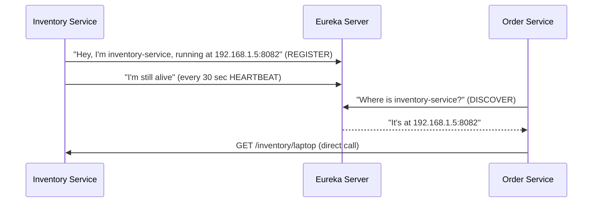
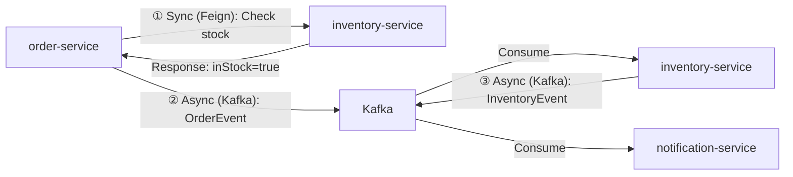
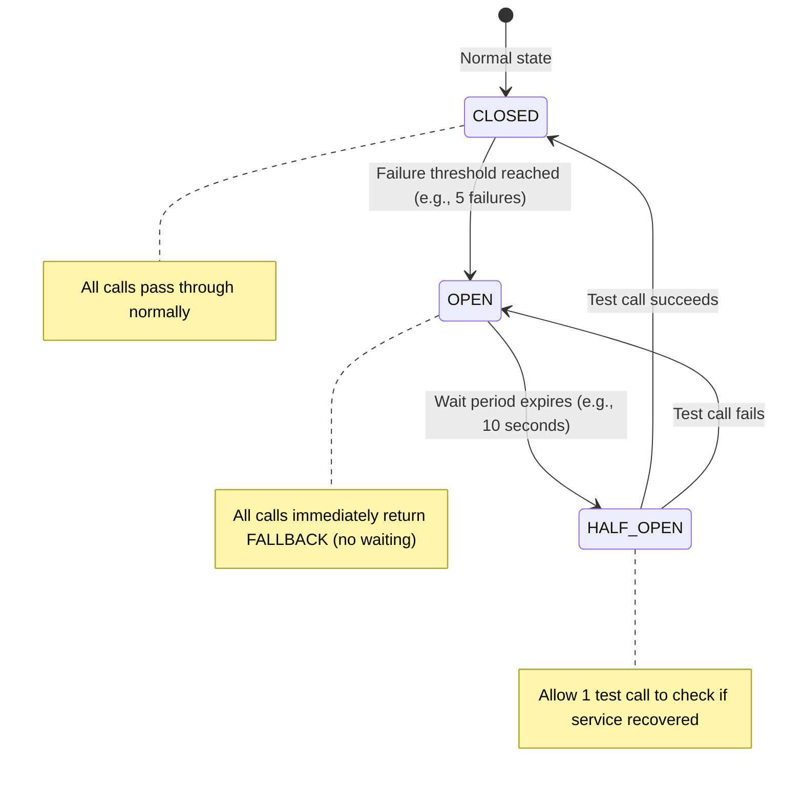
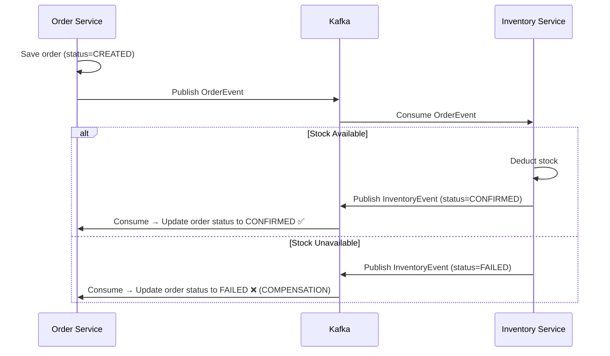

# Microservices Interview Preparation Guide

> Complete guide from **Monolithic → Microservices**, tied to your actual project code.
> Every concept explained with **WHY → WHAT → HOW → Interview Q&A**.

---

## Table of Contents

1. [Monolithic vs Microservices — The Big Picture](#1-monolithic-vs-microservices)
2. [Service Discovery (Eureka)](#2-service-discovery-eureka)
3. [API Gateway](#3-api-gateway)
4. [Sync vs Async Communication](#4-sync-vs-async-communication)
5. [Sync: OpenFeign (REST Client)](#5-sync-openfeign)
6. [Async: Apache Kafka](#6-async-apache-kafka)
7. [Circuit Breaker (Resilience4j)](#7-circuit-breaker-resilience4j)
8. [Load Balancing](#8-load-balancing)
9. [SAGA Pattern & Compensation](#9-saga-pattern)
10. [Dead Letter Topic (DLT)](#10-dead-letter-topic)
11. [Input Validation](#11-input-validation)
12. [Global Exception Handling](#12-global-exception-handling)
13. [DTO Pattern](#13-dto-pattern)
14. [Distributed Tracing (Zipkin)](#14-distributed-tracing-zipkin)
15. [Centralized Logging (ELK Stack)](#15-centralized-logging-elk)
16. [Correlation IDs](#16-correlation-ids)
17. [Actuator & Health Checks](#17-actuator-and-health-checks)
18. [Docker & Docker Compose](#18-docker-and-docker-compose)
19. [Graceful Shutdown](#19-graceful-shutdown)
20. [Rapid-Fire Interview Questions](#20-rapid-fire)

---

<a id="1-monolithic-vs-microservices"></a>
## 1. Monolithic vs Microservices — The Big Picture

### What is Monolithic?

Imagine you're building an **e-commerce app**. In monolithic, **everything** is in ONE project:

```
my-ecommerce-app/
├── OrderController.java
├── InventoryController.java
├── NotificationController.java
├── PaymentController.java
├── OrderService.java
├── InventoryService.java
├── ...
└── application.properties (ONE database, ONE server)
```

- One WAR/JAR file
- One database
- One server
- Everything deployed together

### What is Microservices?

Now imagine **splitting** that into separate, independent projects:

```
order-service/          → Runs on port 8081, has its OWN database
inventory-service/      → Runs on port 8082, has its OWN database
notification-service/   → Runs on port 8083
```

Each service:
- Has its **own codebase**
- Has its **own database** (Database per Service pattern)
- Can be **deployed independently**
- Can be written in **different languages** (though we use Java for all)
- Communicates with others via **REST APIs** or **messages (Kafka)**

### Why Microservices?

| Problem in Monolithic | How Microservices Solves It |
|----------------------|---------------------------|
| One bug in payment module → entire app crashes | Only payment-service crashes, others keep running |
| Want to scale only the order module during sale? Can't — must scale entire app | Scale only order-service to 10 instances |
| Small change → must redeploy entire app (risky) | Change only order-service, redeploy just that |
| 50 developers all working in same codebase → merge conflicts | Separate teams own separate services |
| Stuck with Java everywhere | Each service can use the best language/framework |

### The Trade-off (Important for interviews!)

> [!WARNING]
> Microservices is NOT always better. It introduces **complexity** that monolithic doesn't have.

| Challenge | What You Need |
|-----------|---------------|
| Services need to find each other | **Service Discovery** (Eureka) |
| Need one entry point for clients | **API Gateway** |
| Service A calls Service B — what if B is down? | **Circuit Breaker** |
| How to trace a request across 5 services? | **Distributed Tracing** (Zipkin) |
| Logs scattered across 10 servers | **Centralized Logging** (ELK) |
| Distributed transactions | **SAGA Pattern** |
| Network calls are slow & unreliable | **Retry, Timeout, Fallback** |

### 🎤 Interview Q&A

**Q: When would you NOT use microservices?**
> A: For small applications with a small team (under 5 developers), monolithic is simpler and faster to develop. Microservices add operational overhead — service discovery, distributed tracing, inter-service communication. If you don't need independent scaling or separate deployments, stay monolithic. Start monolithic, evolve to microservices when the pain points appear.

**Q: What is the main disadvantage of microservices?**
> A: Distributed system complexity. You now have network latency between services, partial failures (one service down, others up), data consistency challenges (no single database transaction), and operational overhead (monitoring 20 services vs 1 app). You need additional infrastructure like Eureka, Kafka, Zipkin, ELK just to manage it.

---

<a id="2-service-discovery-eureka"></a>
## 2. Service Discovery (Eureka)

### The Problem

In monolithic, everything is in one app — no need to "find" the inventory module, it's right there.

In microservices:
- `order-service` needs to call `inventory-service`
- But where is it? `localhost:8082`? What if it moves? What if there are 3 instances?
- **Hardcoding URLs is fragile and doesn't scale**

### The Solution: Eureka (Service Registry)

Think of Eureka as a **phone book** for microservices.



### How It Works in Our Project

**Step 1:** Eureka Server runs on port 8761
```java
@SpringBootApplication
@EnableEurekaServer    // ← This makes it a registry
public class EurekaServerApplication { }
```

**Step 2:** Each service registers itself:
```properties
# In order-service application.properties
eureka.client.service-url.defaultZone=http://localhost:8761/eureka
spring.application.name=order-service  # ← This is the name other services use
```

**Step 3:** Services discover each other by **name**, not URL:
```java
@FeignClient(name = "inventory-service")  // ← Eureka resolves this to actual URL
public interface InventoryClient { }
```

### 🎤 Interview Q&A

**Q: What happens if Eureka server goes down?**
> A: Services cache the registry locally. So existing service-to-service calls continue to work using the cached data. But new services can't register, and stale entries won't be removed. In production, you run **multiple Eureka instances** (peer-aware) for high availability.

**Q: What is self-preservation mode in Eureka?**
> A: If Eureka stops receiving heartbeats from many services suddenly (e.g., network partition), instead of deregistering all of them, it enters self-preservation mode and keeps the registrations. This prevents mass deregistration during network glitches. It's a safety net.

**Q: Eureka vs Consul vs Zookeeper?**
> A: Eureka is AP (Available + Partition-tolerant) — favors availability. Consul is CP (Consistent + Partition-tolerant) — favors consistency. Eureka is simpler and Netflix-battle-tested. Consul adds service mesh, health checks, KV store. For Spring Cloud projects, Eureka is the most common choice.

---

<a id="3-api-gateway"></a>
## 3. API Gateway

### The Problem

Without a gateway, clients need to know:
- Order service is at `http://order-host:8081/orders`
- Inventory service is at `http://inventory-host:8082/inventory`
- Notification service is at `http://notif-host:8083/notifications`

That's 3 different URLs. In production with 20 services? Nightmare.

### The Solution: API Gateway

**One door** for all clients. The gateway routes internally.

```
Client → http://gateway:8080/api/orders     → routes to order-service
Client → http://gateway:8080/api/inventory  → routes to inventory-service
```

### What Else Does the Gateway Do?

| Feature | Description |
|---------|-------------|
| **Routing** | `/api/orders` → order-service |
| **Load Balancing** | If 3 instances of order-service, distribute requests |
| **Cross-cutting Concerns** | Authentication, rate limiting, CORS — all in one place |
| **Request/Response Transformation** | Add headers, modify request before forwarding |
| **Logging Filter** | Log every request (method, path, time) for debugging |

### In Our Project

```yaml
# api-gateway application.yml
spring:
  cloud:
    gateway:
      routes:
        - id: order-service
          uri: lb://order-service        # lb:// means use Eureka + Load Balancer
          predicates:
            - Path=/api/orders/**
        - id: inventory-service
          uri: lb://inventory-service
          predicates:
            - Path=/api/inventory/**
```

### 🎤 Interview Q&A

**Q: Spring Cloud Gateway vs Zuul?**
> A: Zuul 1 was blocking (thread-per-request). Spring Cloud Gateway is built on **Project Reactor** (non-blocking, reactive) → much better performance. Zuul 2 was also reactive but Netflix stopped maintaining it for Spring. **Spring Cloud Gateway is the current standard.**

**Q: Why not use Nginx as API Gateway?**
> A: You can! Nginx/Kong are infrastructure-level gateways (L7 load balancing, SSL termination). Spring Cloud Gateway is an **application-level** gateway — it integrates natively with Eureka, Resilience4j, Micrometer. In production, many companies use **both**: Nginx as external LB + Spring Cloud Gateway as internal router.

---

<a id="4-sync-vs-async-communication"></a>
## 4. Sync vs Async Communication

### This is one of the MOST asked interview questions

| Aspect | Synchronous (Feign/REST) | Asynchronous (Kafka/Messages) |
|--------|--------------------------|-------------------------------|
| **How** | Service A calls Service B and **waits** for response | Service A sends a message and **moves on** |
| **Coupling** | Tight — A needs B to be running | Loose — A doesn't even know who consumes the message |
| **Speed** | Blocked until response | Non-blocking, fire-and-forget |
| **Use When** | You **need** the response right now (e.g., "Is stock available?") | You **don't need** immediate response (e.g., "Send email notification") |
| **Failure** | If B is down, A fails (unless circuit breaker) | If consumer is down, message waits in queue |

### In Our Project — Both!



**Why both?**
- **Sync (Feign):** Before placing an order, we NEED to know if stock is available RIGHT NOW. Can't proceed without this answer.
- **Async (Kafka):** After placing the order, we tell inventory to deduct stock and notification to send email. We don't need to wait for these.

### 🎤 Interview Q&A

**Q: When would you choose sync over async?**
> A: Use sync when the caller **needs the result to proceed**. Example: checking if a coupon is valid before applying discount. Use async when the action is **independent** and doesn't affect the response. Example: sending confirmation email after order is placed.

**Q: Can you convert all sync calls to async?**
> A: Technically yes, but it makes the code complex. If you need stock availability before showing the "Place Order" button, async doesn't make sense — you'd have to implement request-reply pattern with correlation IDs, timeouts, etc. Keep it simple: sync for queries, async for events.

---

<a id="5-sync-openfeign"></a>
## 5. Sync Communication: OpenFeign

### What is Feign?

Instead of manually writing `RestTemplate` or `WebClient` code:

```java
// Without Feign — ugly, verbose
RestTemplate restTemplate = new RestTemplate();
ResponseEntity<InventoryResponse> response = restTemplate.getForEntity(
    "http://inventory-service:8082/inventory/" + product,
    InventoryResponse.class
);
```

Feign lets you write an **interface** and Spring generates the HTTP client:

```java
// With Feign — clean, declarative
@FeignClient(name = "inventory-service")
public interface InventoryClient {

    @GetMapping("/inventory/{product}")
    InventoryResponse checkStock(@PathVariable String product);
}
```

Then inject and use it like a normal method call:

```java
@Service
public class OrderService {
    
    @Autowired
    private InventoryClient inventoryClient;  // ← Feign-generated proxy

    public OrderResponse createOrder(OrderRequest request) {
        // This looks like a local method call, but it's actually an HTTP GET!
        InventoryResponse stock = inventoryClient.checkStock(request.getProduct());
        
        if (!stock.isInStock()) {
            throw new InsufficientStockException("Not enough stock");
        }
        // ... proceed
    }
}
```

### Key Points for Interview

- Feign uses **Eureka** to resolve `inventory-service` → actual IP:port
- Feign integrates with **Resilience4j** for circuit breaking
- Feign integrates with **Micrometer** for tracing (traceId is propagated automatically)
- `@FeignClient(name = "inventory-service")` — the name **must match** the `spring.application.name` of the target service

### 🎤 Interview Q&A

**Q: Feign vs RestTemplate vs WebClient?**
> A: 
> - **RestTemplate** — older, synchronous, verbose, deprecated for new projects.
> - **WebClient** — newer, supports both sync and async (reactive), more powerful but more complex.
> - **Feign** — declarative (just an interface), integrates with Eureka and Resilience4j out of the box. Best for **service-to-service sync calls in Spring Cloud**.
> 
> In Spring Cloud projects, Feign is the standard for sync inter-service calls.

---

<a id="6-async-apache-kafka"></a>
## 6. Async Communication: Apache Kafka

### What is Kafka?

Kafka is a **distributed message broker**. Think of it as a **post office**:

- **Producer** = person who drops a letter
- **Topic** = the mailbox (letters go into topics)
- **Consumer** = person who picks up the letter
- **Consumer Group** = a team where each person handles different letters (no duplicates)

### Key Kafka Concepts

```
┌──────────────────────────────────────────┐
│              Topic: orders-v2            │
│  ┌──────────┐ ┌──────────┐ ┌──────────┐ │
│  │Partition 0│ │Partition 1│ │Partition 2│ │
│  │ msg1      │ │ msg2      │ │ msg3      │ │
│  │ msg4      │ │ msg5      │ │ msg6      │ │
│  └──────────┘ └──────────┘ └──────────┘ │
└──────────────────────────────────────────┘
         ↑                      ↓
    OrderProducer          OrderConsumer
  (order-service)       (inventory-service)
                       group: inventory-group
```

| Concept | Meaning | Analogy |
|---------|---------|---------|
| **Topic** | A named channel/category for messages | A TV channel |
| **Partition** | Subdivision of a topic for parallelism | Lanes in a highway |
| **Offset** | Position of a message within a partition | Page number in a book |
| **Consumer Group** | Group of consumers that share work | Team splitting tasks |
| **Producer** | Sends messages to a topic | News reporter |
| **Consumer** | Reads messages from a topic | TV viewer |

### In Our Project

**Producer (order-service):**
```java
@Service
public class OrderProducer {
    
    @Autowired
    private KafkaTemplate<String, OrderEvent> kafkaTemplate;

    public void sendOrder(OrderEvent order) {
        kafkaTemplate.send("orders-v2", order);  // Fire and forget
    }
}
```

**Consumer (inventory-service):**
```java
@Service
public class OrderConsumer {

    @KafkaListener(topics = "orders-v2", groupId = "inventory-group")
    public void consume(OrderEvent orderEvent) {
        // Process the order — check stock, deduct, publish result
    }
}
```

### Why Kafka over RabbitMQ?

| Feature | Kafka | RabbitMQ |
|---------|-------|----------|
| **Throughput** | Millions of messages/sec | Thousands/sec |
| **Message Retention** | Keeps messages even after consumption (configurable) | Deletes after consumption |
| **Replay** | Can re-read old messages (replay) | Cannot |
| **Best For** | Event streaming, logs, high throughput | Task queues, RPC-like patterns |

### 🎤 Interview Q&A

**Q: What happens if a Kafka consumer crashes mid-processing?**
> A: If auto-commit is enabled (default), the offset was already committed, and the message is skipped — **data loss**. If you use **manual offset commit**, the offset isn't committed until processing succeeds, so Kafka will redeliver the message when the consumer restarts. That's why in production, we use manual commits for critical data.

**Q: What is a Consumer Group?**
> A: Multiple consumers with the same `groupId` share the partitions of a topic. If a topic has 3 partitions and you have 3 consumers in the same group, each consumer reads from one partition — **parallel processing, no duplicates**. If a consumer dies, its partition is rebalanced to another consumer in the group.

**Q: What is `auto-offset-reset=latest` vs `earliest`?**
> A: `latest` = new consumer only reads messages that arrive **after** it joins. `earliest` = new consumer reads **all** messages from the beginning. In our project, we use `latest` because we don't want to process old orders when a service restarts.

---

<a id="7-circuit-breaker-resilience4j"></a>
## 7. Circuit Breaker (Resilience4j)

### The Problem: Cascading Failures

```
Order Service → calls → Inventory Service (DOWN!)
                         ↓
                    Order Service waits... 30 sec timeout
                    Order Service waits... 30 sec timeout
                    Order Service waits... 30 sec timeout
                         ↓
                    Thread pool exhausted!
                    Order Service also goes DOWN!
                         ↓
                    API Gateway can't reach Order Service
                    ENTIRE SYSTEM DOWN! 💀
```

This is called **cascading failure** — one service brings down everything.

### The Solution: Circuit Breaker

Like an electrical circuit breaker that trips when there's too much current:



| State | Behavior |
|-------|----------|
| **CLOSED** | Everything normal. Calls go through. Failures are counted. |
| **OPEN** | Too many failures. **Stop calling**. Return fallback immediately. No waiting. |
| **HALF-OPEN** | After a wait period, try ONE call. If it works → CLOSED. If it fails → OPEN again. |

### In Our Project

```java
// Feign client with fallback
@FeignClient(
    name = "inventory-service",
    fallback = InventoryFallback.class   // ← This runs when circuit is OPEN
)
public interface InventoryClient {
    @GetMapping("/inventory/{product}")
    InventoryResponse checkStock(@PathVariable String product);
}

// Fallback class — what to do when inventory-service is down
@Component
public class InventoryFallback implements InventoryClient {
    @Override
    public InventoryResponse checkStock(String product) {
        // Return a "we don't know" response instead of crashing
        return new InventoryResponse(product, 0, false, "Stock check unavailable");
    }
}
```

### 🎤 Interview Q&A

**Q: Circuit Breaker vs Retry — when to use which?**
> A: **Retry** = try again for transient failures (network hiccup, temporary timeout). Use for short-lived problems. **Circuit Breaker** = stop trying altogether when the service is genuinely DOWN. Use for prolonged failures. In practice, **combine both**: retry 3 times → if all fail → circuit opens.

**Q: What is bulkhead pattern?**
> A: Separate thread pools for different external calls. If inventory-service call hangs, it only blocks its own thread pool (10 threads). The payment-service thread pool (10 different threads) is unaffected. Like watertight compartments in a ship — one leaks, the whole ship doesn't sink.

---

<a id="8-load-balancing"></a>
## 8. Load Balancing

### Client-Side Load Balancing (Spring Cloud)

In traditional load balancing (Nginx), a central server distributes requests. In Spring Cloud, the **client itself** decides which instance to call:

```
Eureka knows:
  inventory-service → [192.168.1.5:8082, 192.168.1.6:8082, 192.168.1.7:8082]

When order-service calls inventory-service:
  Spring Cloud LoadBalancer picks one (round-robin by default)
```

The `lb://` prefix in gateway routes and Feign's `@FeignClient(name = "...")` both use this.

### 🎤 Interview Q&A

**Q: Client-side vs Server-side load balancing?**
> A: Server-side (Nginx, AWS ELB) — a central server routes traffic. Client-side (Spring Cloud LoadBalancer) — the calling service itself chooses which instance to call using the registry. Spring Cloud uses client-side because each service already has the Eureka registry cached locally.

---

<a id="9-saga-pattern"></a>
## 9. SAGA Pattern & Compensation

### The Problem: Distributed Transactions

In monolithic:
```java
@Transactional  // ← ONE database, ONE transaction
public void placeOrder() {
    orderRepo.save(order);           // Step 1
    inventoryRepo.deductStock();     // Step 2
    paymentRepo.charge();            // Step 3
    // If Step 3 fails → everything rolls back automatically!
}
```

In microservices, **each service has its own database**. You CAN'T use `@Transactional` across services. So what if:
1. Order is created ✅
2. Inventory deducted ✅
3. Payment fails ❌

Now you have an order with no payment and reduced stock. **Data inconsistency!**

### The Solution: SAGA Pattern

Instead of one big transaction, use a **sequence of local transactions** with **compensation** (undo) for failures.

### In Our Project (Choreography-based SAGA)



**The key:** Order-service listens for the `InventoryEvent` and **updates its own order status**. If inventory says FAILED, the order is marked FAILED — that's the **compensation** (rollback without a distributed transaction).

### Two Types of SAGA

| Type | How it works | Pros | Cons |
|------|-------------|------|------|
| **Choreography** (our project) | Each service publishes events, others react | Simple, decoupled | Hard to track flow with many services |
| **Orchestration** | One central "orchestrator" service tells each service what to do | Easy to track, centralized logic | Single point of failure, tighter coupling |

### 🎤 Interview Q&A

**Q: How do you handle a scenario where order is created but payment fails?**
> A: Using SAGA pattern. Each step is a local transaction. If payment fails, it publishes a `PaymentFailedEvent`. Order-service consumes this and updates order status to `FAILED` (compensation). Inventory-service consumes this and restores the deducted stock (compensation). Each service "undoes" its own work.

**Q: Choreography vs Orchestration — which is better?**
> A: For 2-3 services, choreography (event-based) is simpler. For 5+ services with complex flows, orchestration (central coordinator) is better because tracking the flow through 10 event chains becomes unmanageable. Tools like Temporal or Camunda help with orchestration.

---

<a id="10-dead-letter-topic"></a>
## 10. Dead Letter Topic (DLT)

### The Problem

What if a Kafka consumer throws an exception while processing a message?

```java
@KafkaListener(topics = "orders-v2")
public void consume(OrderEvent event) {
    inventoryService.deductStock(event.getProduct());  // ← Throws exception!
    // Message is retried... fails again... retried... fails again... INFINITE LOOP!
}
```

### The Solution: Dead Letter Topic

After N retries, move the failed message to a **Dead Letter Topic** (DLT). It's a "parking lot" for failed messages.

```
orders-v2 topic          →  consumer fails  →  orders-v2.DLT (dead letter)
                             3 retries            ↓
                                          DltConsumer logs it
                                          Alert sent to dev team
```

### 🎤 Interview Q&A

**Q: What do you do with messages in DLT?**
> A: Monitor and alert. A DLT consumer logs failed messages to Kibana. Dev team investigates the root cause (bad data? bug? dependency down?), fixes the issue, and then replays the messages from DLT back to the original topic.

---

<a id="11-input-validation"></a>
## 11. Input Validation

### Without Validation (Dangerous!)

```json
POST /orders
{
    "customerName": "",        ← Empty! Who ordered this?
    "product": null,           ← No product!
    "quantity": -5             ← Negative quantity!
}
```

This goes straight into the database. Bad data everywhere.

### With Validation

```java
public class OrderRequest {

    @NotBlank(message = "Customer name is required")
    private String customerName;

    @NotBlank(message = "Product is required")
    private String product;

    @NotNull(message = "Quantity is required")
    @Min(value = 1, message = "Quantity must be at least 1")
    private Integer quantity;
}
```

```java
// Controller — @Valid triggers the validation
@PostMapping
public OrderResponse createOrder(@Valid @RequestBody OrderRequest request) {
    return orderService.createOrder(request);
}
```

If validation fails, Spring automatically returns a `400 Bad Request` with error details.

### 🎤 Interview Q&A

**Q: Where should validation happen — controller or service layer?**
> A: **Both**. Controller-level validation (`@Valid`) handles basic field-level checks (not blank, min value). Service-level validation handles **business rules** (e.g., "this customer has exceeded their credit limit"). They serve different purposes.

---

<a id="12-global-exception-handling"></a>
## 12. Global Exception Handling

### Without It

When an exception is thrown, the client gets a raw ugly response:

```json
{
    "timestamp": "2024-01-15T10:30:00",
    "status": 500,
    "error": "Internal Server Error",
    "trace": "java.lang.NullPointerException at com.kiran.orderservice..."  ← SECURITY RISK!
}
```

Exposing stack traces is a **security vulnerability**.

### With `@ControllerAdvice`

```java
@RestControllerAdvice
public class GlobalExceptionHandler {

    @ExceptionHandler(OrderNotFoundException.class)
    public ResponseEntity<ErrorResponse> handleOrderNotFound(OrderNotFoundException ex) {
        ErrorResponse error = new ErrorResponse(
            HttpStatus.NOT_FOUND.value(),
            ex.getMessage(),
            LocalDateTime.now()
        );
        return ResponseEntity.status(HttpStatus.NOT_FOUND).body(error);
    }

    @ExceptionHandler(MethodArgumentNotValidException.class)
    public ResponseEntity<ErrorResponse> handleValidation(MethodArgumentNotValidException ex) {
        String message = ex.getBindingResult().getFieldErrors().stream()
            .map(e -> e.getField() + ": " + e.getDefaultMessage())
            .collect(Collectors.joining(", "));
        
        ErrorResponse error = new ErrorResponse(400, message, LocalDateTime.now());
        return ResponseEntity.badRequest().body(error);
    }

    @ExceptionHandler(Exception.class)   // ← Catch-all for unexpected errors
    public ResponseEntity<ErrorResponse> handleGeneric(Exception ex) {
        ErrorResponse error = new ErrorResponse(500, "Something went wrong", LocalDateTime.now());
        return ResponseEntity.status(500).body(error);
    }
}
```

Now the client always gets a clean, consistent response:
```json
{
    "status": 404,
    "message": "Order not found with id: 99",
    "timestamp": "2024-01-15T10:30:00"
}
```

---

<a id="13-dto-pattern"></a>
## 13. DTO Pattern

### Why Not Expose Entities Directly?

```java
// BAD — Entity has DB annotations, internal fields
@Entity
public class Order {
    @Id @GeneratedValue
    private Long id;
    private String customerName;
    private String internalNotes;    // ← Client should NOT see this!
    private String status;
    // ... JPA annotations, Hibernate proxies
}
```

If you return this directly, you expose:
- Internal database fields
- Hibernate proxy objects
- Tight coupling between API contract and database schema

### The DTO Pattern

```
Client → OrderRequest (DTO) → Controller → Entity → Database
Database → Entity → Service → OrderResponse (DTO) → Client
```

- **OrderRequest**: Only fields the client should SEND (customerName, product, quantity)
- **OrderResponse**: Only fields the client should SEE (orderId, status, message)
- **Order** (Entity): Database representation (id, createdDate, internalStatus, etc.)

### 🎤 Interview Q&A

**Q: Why not just use the entity for request and response?**
> A: Three reasons: (1) **Security** — don't expose internal fields like `internalNotes` or `password`. (2) **Decoupling** — changing the database schema shouldn't break the API contract. (3) **Flexibility** — response might combine data from multiple entities or add computed fields.

---

<a id="14-distributed-tracing-zipkin"></a>
## 14. Distributed Tracing (Zipkin)

### The Problem

A user reports: "My order took 8 seconds." The request went through:
```
Gateway → Order Service → Inventory Service (Feign) → Kafka → Notification Service
```

Where was the delay? In which service? Which method?

### The Solution: Tracing

Every request gets a unique **Trace ID**. Each service's work is a **Span**.

```
Trace ID: abc-123
├── Span 1: API Gateway (2ms)
├── Span 2: Order Service (50ms)
│   ├── Span 3: Feign call to Inventory Service (3000ms) ← HERE'S THE PROBLEM!
│   └── Span 4: Kafka publish (5ms)
└── Span 5: Notification Service (10ms)
```

Zipkin visualizes this as a **waterfall timeline** showing exactly which service/call is slow.

### How It Works

1. **Micrometer Tracing** (in each service) generates trace IDs and sends them to Zipkin
2. Trace IDs propagate automatically through:
   - HTTP headers (for Feign/REST calls)
   - Kafka headers (for async messages)
3. **Zipkin UI** (`:9411`) shows the complete request journey

### 🎤 Interview Q&A

**Q: What is the difference between Trace and Span?**
> A: A **Trace** is the entire journey of a request across all services (like a trip). A **Span** is one unit of work within that trace (like a stop on the trip). A trace contains multiple spans. Example: Trace = "Place Order", Spans = "Validate request", "Check inventory", "Save to DB", "Send Kafka event".

**Q: How are trace IDs propagated across Kafka?**
> A: Micrometer Tracing with Brave puts the trace ID into **Kafka message headers** (not the message body). The consumer extracts it from headers and continues the same trace. This is done automatically with the `micrometer-tracing-bridge-brave` library.

---

<a id="15-centralized-logging-elk"></a>
## 15. Centralized Logging (ELK Stack)

### The Problem

You have 5 services, each with its own log file:
```
order-service.log       → on Server A
inventory-service.log   → on Server B
notification-service.log → on Server C
```

To debug one issue, you SSH into 3 servers, `grep` through 3 log files, and try to correlate timestamps manually. **Painful.**

### The Solution: ELK Stack

| Component | What It Does | Port |
|-----------|-------------|------|
| **E** - Elasticsearch | Stores and indexes all logs (search engine) | 9200 |
| **L** - Logstash | Receives logs from all services, parses them, sends to ES | 5044 |
| **K** - Kibana | Web UI to search, filter, and visualize logs | 5601 |

### How It Works in Our Project

```
order-service     → Logback (JSON format) → TCP → Logstash → Elasticsearch → Kibana
inventory-service → Logback (JSON format) → TCP → Logstash → Elasticsearch → Kibana
notification-svc  → Logback (JSON format) → TCP → Logstash → Elasticsearch → Kibana
```

**Step 1:** Each service has a `logback-spring.xml` that formats logs as JSON and sends them to Logstash via TCP:

```xml
<appender name="LOGSTASH" class="net.logstash.logback.appender.LogstashTcpSocketAppender">
    <destination>localhost:5044</destination>
    <encoder class="net.logstash.logback.encoder.LogstashEncoder">
        <customFields>{"service":"order-service"}</customFields>
    </encoder>
</appender>
```

**Step 2:** Logstash receives, parses, and forwards to Elasticsearch:

```
input { tcp { port => 5044 codec => json_lines } }
output { elasticsearch { hosts => ["elasticsearch:9200"] } }
```

**Step 3:** In Kibana, you can search:
- `service:"order-service" AND level:"ERROR"` → all errors in order service
- `traceId:"abc-123"` → all logs from all services for one request
- `message:"Order Created" AND customerName:"Kiran"` → find specific log

### 🎤 Interview Q&A

**Q: Why JSON logging instead of plain text?**
> A: Plain text logs like `2024-01-15 INFO Order created for Kiran` are human-readable but hard to search and parse programmatically. JSON logs like `{"timestamp":"2024-01-15","level":"INFO","message":"Order created","customerName":"Kiran","traceId":"abc123"}` are **structured** — Elasticsearch can index each field separately, making it searchable by any field.

**Q: ELK vs Loki+Grafana?**
> A: ELK is more powerful (full-text search, complex queries) but heavier (Elasticsearch needs lots of RAM). Loki (by Grafana) is lightweight and uses labels instead of full-text indexing — much cheaper to run. ELK is the industry standard for log analytics. Loki is gaining popularity for Kubernetes environments.

---

<a id="16-correlation-ids"></a>
## 16. Correlation IDs (Trace IDs in Logs)

### The Killer Feature

This ties everything together. The **same trace ID** appears in:
1. **Zipkin** (visual trace timeline)
2. **Kibana** (log search)
3. **Every log line** from every service

```json
// order-service log
{"timestamp":"2024-01-15T10:30:00","service":"order-service","traceId":"abc123","message":"Order created, id=42"}

// inventory-service log  
{"timestamp":"2024-01-15T10:30:01","service":"inventory-service","traceId":"abc123","message":"Stock deducted for laptop, remaining=48"}

// notification-service log
{"timestamp":"2024-01-15T10:30:02","service":"notification-service","traceId":"abc123","message":"Email notification sent for order 42"}
```

Search Kibana for `traceId:"abc123"` → you see the **complete story** of that request across all services. Copy the same `abc123` into Zipkin → you see the **timing breakdown**.

### 🎤 Interview Q&A

**Q: How do you debug a production issue where a customer says their order failed?**
> A: 
> 1. Get the order ID from the customer
> 2. Search Kibana: `orderId:42` → find the `traceId`
> 3. Search Kibana: `traceId:abc123` → see ALL logs from ALL services for that order
> 4. Find the error log with stack trace → identify root cause
> 5. Open Zipkin with the same traceId → see timing breakdown to check if any service was slow
> 
> This is the **standard production debugging workflow**.

---

<a id="17-actuator-and-health-checks"></a>
## 17. Actuator & Health Checks

### What is Actuator?

Spring Boot Actuator exposes **operational endpoints** for monitoring:

| Endpoint | What It Shows |
|----------|--------------|
| `/actuator/health` | Is the service UP? Are DB, Kafka, Eureka connections healthy? |
| `/actuator/info` | Application info (version, description) |
| `/actuator/metrics` | JVM memory, CPU, HTTP request counts |
| `/actuator/env` | Environment variables and config properties |

### Why It Matters

In production, Kubernetes or load balancers use `/actuator/health` to decide:
- Should I route traffic to this instance? (liveness probe)
- Is this instance ready to receive requests? (readiness probe)
- Should I restart this instance? (if health returns DOWN)

### 🎤 Interview Q&A

**Q: What is the difference between liveness and readiness probes?**
> A: **Liveness** = "Is the process alive?" If no → restart the container. **Readiness** = "Can it handle requests?" If no → stop sending traffic, but don't restart. Example: a service is alive but still loading data from DB → liveness=UP, readiness=DOWN until loading is complete.

---

<a id="18-docker-and-docker-compose"></a>
## 18. Docker & Docker Compose

### Why Docker?

"It works on my machine" → Docker ensures it works **everywhere**.

A Docker container packages your app + JDK + configs into a single runnable unit.

### Docker Compose for Our Project

Instead of manually installing Kafka, Zookeeper, Elasticsearch, Logstash, Kibana, and Zipkin, we use Docker Compose:

```bash
docker-compose up -d  # ← ONE command starts EVERYTHING
```

This starts:
- Zookeeper (Kafka needs it)
- Kafka broker
- Zipkin (tracing UI)
- Elasticsearch (log storage)
- Logstash (log pipeline)
- Kibana (log visualization)

### 🎤 Interview Q&A

**Q: Docker vs Virtual Machine?**
> A: VMs virtualize the **entire OS** (each VM has its own kernel) — heavy, slow to start, GBs in size. Docker containers share the **host OS kernel** — lightweight, start in seconds, MBs in size. Docker is for application-level isolation, VMs are for OS-level isolation.

**Q: Docker vs Kubernetes?**
> A: Docker **runs** containers. Kubernetes **orchestrates** containers — decides how many instances to run, where to run them, auto-restarts crashed containers, scales up/down, handles rolling deployments. Docker = the car. Kubernetes = the traffic management system.

---

<a id="19-graceful-shutdown"></a>
## 19. Graceful Shutdown

### The Problem

If you kill a service while it's processing a Kafka message or HTTP request:
- HTTP response never sent → client gets connection reset
- Kafka message half-processed → data inconsistency

### The Solution

```properties
server.shutdown=graceful
spring.lifecycle.timeout-per-shutdown-phase=30s
```

When you stop the service:
1. Stop accepting **new** requests
2. Finish processing **in-flight** requests (up to 30 seconds)
3. Then shut down

### 🎤 Interview Q&A

**Q: How do you deploy a new version without downtime?**
> A: Rolling deployment. Run 3 instances. Deploy new version to instance 1 (graceful shutdown + restart). Once it's healthy, deploy to instance 2, then 3. At any point, at least 2 instances are serving traffic. Kubernetes handles this automatically.

---

<a id="20-rapid-fire"></a>
## 20. 🔥 Rapid-Fire Interview Questions

### Architecture & Design

**Q: What is the Database per Service pattern?**
> Each microservice has its own private database. No direct cross-service DB queries. Services communicate via APIs or events. This ensures loose coupling — you can change order-service's DB from H2 to PostgreSQL without affecting other services.

**Q: What is Event Sourcing?**
> Instead of storing the current state, store a **sequence of events** (OrderCreated, OrderPaid, OrderShipped). Current state is derived by replaying events. Kafka's log-based storage naturally supports this.

**Q: What is CQRS?**
> Command Query Responsibility Segregation. Use different models for **reads** and **writes**. Write model (normalized, consistent) vs Read model (denormalized, fast). Often combined with Event Sourcing.

**Q: How do you handle API versioning?**
> URL versioning (`/api/v1/orders`, `/api/v2/orders`), header versioning (`Accept: application/vnd.myapp.v2+json`), or query param (`/api/orders?version=2`). URL versioning is most common and readable.

---

### Kafka Deep Dive

**Q: How do you guarantee message ordering in Kafka?**
> Messages within a **single partition** are ordered. Use a consistent message key (e.g., orderId) so all messages for the same order go to the same partition.

**Q: What is idempotency in Kafka?**
> Processing the same message twice should produce the same result. Example: deducting stock — check if the deduction was already done before doing it again. Use a unique `eventId` to track processed messages.

**Q: Kafka `at-least-once` vs `at-most-once` vs `exactly-once`?**
> - **At-most-once**: Commit offset before processing. If processing fails, message is lost.
> - **At-least-once** (common): Process first, then commit. If crash after processing but before commit, message is redelivered → duplicates possible. Handle with idempotency.
> - **Exactly-once**: Use Kafka transactions + idempotent producer. Most expensive, rarely needed.

---

### Spring Cloud

**Q: What is Spring Cloud?**
> A collection of tools/libraries for building microservices in Java: Eureka (discovery), Gateway (routing), Feign (HTTP client), Resilience4j (fault tolerance), Config Server (centralized config), Sleuth/Micrometer (tracing).

**Q: How do you handle configuration in microservices?**
> Spring Cloud Config Server — stores all configs in a Git repo. Services fetch their config at startup. Changes in Git are reflected without redeployment (using `@RefreshScope` + `/actuator/refresh`).

---

### Production & DevOps

**Q: How do you monitor microservices?**
> Three pillars: **Logs** (ELK/Loki), **Metrics** (Prometheus + Grafana), **Traces** (Zipkin/Jaeger). Actuator exposes metrics. Alerting on error rates, latency p99, and resource usage.

**Q: What is a Service Mesh?**
> Infrastructure layer that handles service-to-service communication (TLS, retries, circuit breaking, load balancing) WITHOUT code changes. Tools: Istio, Linkerd. It uses sidecar proxies alongside each service.

**Q: How do you handle security in microservices?**
> API Gateway handles authentication (JWT token validation). Each service validates the token's claims for authorization. Use OAuth2 + JWT. Gateway extracts user info from token and passes it as headers to downstream services.

**Q: What is Rate Limiting?**
> Limit the number of API calls a client can make (e.g., 100 requests/minute). Implemented at the API Gateway level using Spring Cloud Gateway's `RequestRateLimiter` filter with Redis as the rate limiter backend.

---

## 📋 Quick Reference: Our Project Maps to Interview Answers

| Interview Question | Point to This in Your Project |
|---|---|
| "Explain microservice architecture" | 3 independent services + Eureka + Gateway |
| "How do services communicate?" | Feign (sync) + Kafka (async) — both in order-service |
| "What if a service is down?" | Circuit Breaker with fallback in InventoryClient |
| "How do you handle distributed transactions?" | SAGA — InventoryEvent feeds back to order-service |
| "How do you trace a request?" | Zipkin — show the trace waterfall |
| "How do you search logs?" | Kibana — search by traceId across all services |
| "What about message failures?" | Dead Letter Topic + DltConsumer |
| "How do you validate input?" | @Valid + @NotBlank on OrderRequest |
| "How do you handle errors?" | @ControllerAdvice + GlobalExceptionHandler |
| "How do you deploy?" | Docker Compose for infra, each service is an independent JAR |

> [!TIP]
> **Interview strategy:** Don't just say "I used Eureka for service discovery." Instead say: "In my project, I have 3 services — order, inventory, and notification. They register with Eureka. When order-service needs to call inventory-service via Feign, it resolves the name `inventory-service` through Eureka. If I run 3 instances of inventory-service, Spring Cloud LoadBalancer distributes calls across them, and if one is down, the circuit breaker kicks in with a fallback response." — **That's how you impress.**
