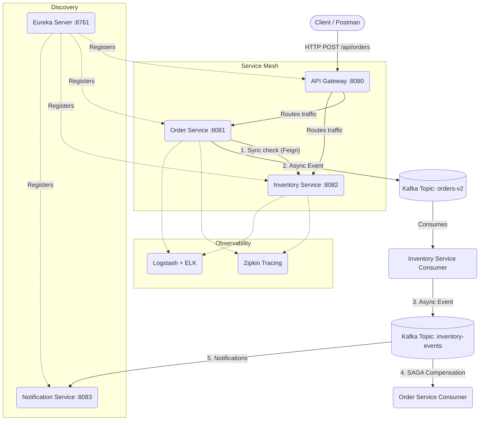

# Spring Cloud Microservices Patterns 🚀

A comprehensive, event-driven microservices architecture built with Spring Boot and Spring Cloud. This repository serves as a masterclass and reference implementation for **28 core microservices patterns and concepts**, making it perfect for learning and interview preparation.

---

## 🏗️ Architecture Overview

The system simulates an e-commerce order fulfillment process involving synchronous validation and asynchronous event-driven state compensation (SAGA pattern).



---

## 🛠️ Tech Stack & Patterns Implemented

- **Core**: Java 17, Spring Boot 3.x
- **Service Discovery**: Spring Cloud Netflix Eureka
- **API Gateway**: Spring Cloud Gateway
- **Synchronous Comm**: OpenFeign
- **Fault Tolerance**: Resilience4j (Circuit Breaker, Retry, Fallback)
- **Asynchronous Comm**: Apache Kafka
- **Distributed Tracing**: Micrometer Tracing + Zipkin
- **Centralized Logging**: ELK Stack (Elasticsearch, Logstash, Kibana) + Logback JSON Encoder
- **Database**: H2 In-Memory + Spring Data JPA
- **Validation**: Jakarta Validation (`@Valid`)
- **Exception Handling**: Global `@ControllerAdvice`
- **Patterns**: SAGA (Choreography), Dead Letter Topics (DLT)

---

## 🚀 How to Run Locally

### 1. Start Infrastructure (Docker)
You need Docker installed to run Kafka, Zipkin, and the ELK stack.
```bash
docker-compose up -d
```
*Wait ~1 minute for Elasticsearch and Kafka to fully initialize.*

### 2. Start Microservices (Maven)
Start the services **in this exact order**:
1. **`eureka-server`** (Starts on port `8761`)
2. **`api-gateway`** (Starts on port `8080`)
3. **`inventory-service`** (Starts on port `8082`)
4. **`order-service`** (Starts on port `8081`)
5. **`notification-service`** (Starts on port `8083`)

### 3. Key Dashboards
- **Eureka Registry**: [http://localhost:8761](http://localhost:8761)
- **Zipkin Traces**: [http://localhost:9411](http://localhost:9411)
- **Kibana Logs**: [http://localhost:5601](http://localhost:5601)

---

## 🧪 Testing the Flow

All requests are routed through the API Gateway at `localhost:8080`.

**1. Check Initial Inventory**
```bash
curl http://localhost:8080/api/inventory
```
*(Sample data like 'laptop' and 'phone' are pre-loaded).*

**2. Place an Order (Success Flow)**
```bash
curl -X POST http://localhost:8080/api/orders \
-H "Content-Type: application/json" \
-d '{"customerName":"Kiran", "product":"laptop", "quantity":2}'
```
*Observe the logs: Order is `CREATED`, Kafka event is sent, Inventory deducts stock, and sends a `CONFIRMED` event back to update the Order status and trigger an email in the Notification service.*

**3. Place an Order (SAGA Compensation / Failure Flow)**
```bash
curl -X POST http://localhost:8080/api/orders \
-H "Content-Type: application/json" \
-d '{"customerName":"Kiran", "product":"laptop", "quantity":5000}'
```
*Observe the logs: Order is `CREATED`, but Inventory service detects insufficient stock and publishes a `FAILED` event. The Order service consumes this and compensates by marking the order as `FAILED`.*

**4. Circuit Breaker Test**
Stop the `inventory-service` and place an order.
*Observe: The `InventoryFallback` class returns a default response, the circuit breaker opens, and the order is saved as `CREATED` pending asynchronous validation.*

---

## 📖 Interview Preparation Guide

This repository contains a massive, detailed **[Interview Preparation Guide (INTERVIEW_PREP.md)](INTERVIEW_PREP.md)** right in the root folder. It covers all 28 patterns implemented in this project in a "Why -> What -> How" format, complete with sample interview Q&A.
